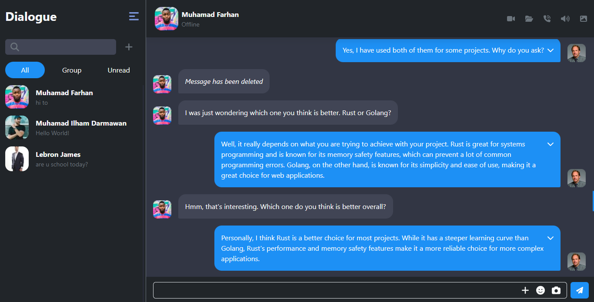
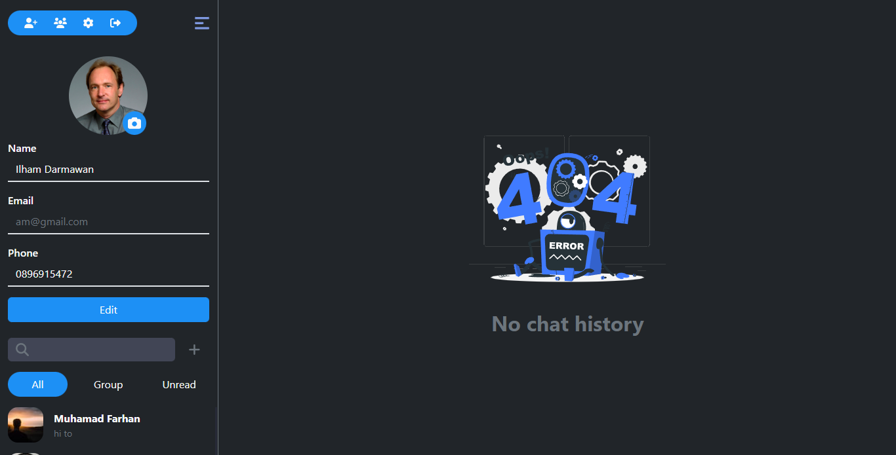

<p align="center">
<div align="center">
<h1 align="center">Dialogue</h1>
</div>
  <h3 align="center">Dialogue (Realtime Chat App)</h3>
  <p align="center">
    <a href="https://github.com/mhmdiamd/ui-dialogue-pijarcamp"><strong>Explore the docs »</strong></a>
    <br />
    <a href="https://iam-dialogue.vercel.app/">View Demo</a>
    <br />
    <a href="https://elated-capris-seal.cyclic.app/api/v1">Api Demo</a>
  </p>
</p>

<!-- TABLE OF CONTENTS -->

## Table of Contents

- [Table of Contents](#table-of-contents)
- [About The Project](#about-the-project)
  - [Built With](#built-with)
- [Getting Started](#getting-started)
  - [Prerequisites](#prerequisites)
  - [Installation](#installation)
  - [Setup .env](#setup-env)
- [Screenshots](#screenshots)
- [Contributing](#contributing)
- [Related Project](#related-project)
- [Contact](#contact)

<!-- ABOUT THE PROJECT -->

## About The Project

Dialogue is a website project aimed to facilitate real-time communication between connected users. With an easy-to-use chat feature, users can communicate with each other quickly and efficiently.

The main feature of Dialogue is the ability to create chat groups with friends or colleagues. To use Dialogue, users only need to create an account and start inviting their friends or colleagues to join the group or send private messages. Dialogue is designed to be user-friendly and accessible to all levels of users.

<!-- GETTING STARTED -->

## Getting Started

### Prerequisites

This is an example of how to list things you need to use the software and how to install them.

- [nodejs](https://nodejs.org/en/download/)
- [Bootstrap Css](https://getbootstrap.com/)
- [React JS](https://reactjs.org/)
- [Redux](https://redux.js.org/)

### Installation

- Clone This Front End Repo

```
git clone https://github.com/mhmdiamd/ui-dialogue-pijarcamp
```

- Go To Folder Repo

```
cd ui-shop-app
```

- Install Module

```
npm install
```

- <a href="#setup-env">Setup .env</a>
- Type ` npm run dev` To Start Website
- Type ` npm run production` To Start Production

### Setup .env

Create .env file in your root project folder.

```
VITE_APP_ENDPOINT = [BACKEND_URL]
```

<!-- ROADMAP -->

## Screenshots

<table>
  <tr>
    <td></td>
    <td> </td>
  </tr>
   <tr>
    <td>Register</td>
    <td>Login</td>
  </tr>

  <tr>
    <td></td>
    <td> </td>
  </tr>
   <tr>
    <td>Home</td>
    <td>Add Contact</td>
  </tr>

  <tr>
    <td></td>
    <td> </td>
  </tr>
   <tr>
    <td>Create Group</td>
    <td>Profile</td>
  </tr>

  <tr>
    <td></td>
    <td> </td>
  </tr>
   <tr>
    <td>Register Mobile</td>
    <td>Login Mobile</td>
  </tr>

  <tr>
    <td></td>
    <td> </td>
  </tr>
   <tr>
    <td>Profile Mobile</td>
    <td>Chat Mobile</td>
  </tr>

</table>
<!-- CONTRIBUTING -->

## Contributing

Contributions are what make the open source community such an amazing place to be learn, inspire, and create. Any contributions you make are **greatly appreciated**.

1. Fork the Project
2. Create your Feature Branch (`git checkout -b feature/AmazingFeature`)
3. Commit your Changes (`git commit -m 'Add some AmazingFeature'`)
4. Push to the Branch (`git push origin feature/AmazingFeature`)
5. Open a Pull Request

## Related Project

:rocket: [`Backend Dialogue`](https://github.com/mhmdiamd/restapi-realtime-chat-pijarcamp)

:rocket: [`Frontend Dialogue`](https://github.com/mhmdiamd/ui-dialogue-pijarcamp)

:rocket: [`Demo Dialogue`](https://iam-dialogue.vercel.app/)

Project Link: [https://github.com/mhmdiamd/ui-dialogue-pijarcamp](https://github.com/mhmdiamd/ui-dialogue-pijarcamp)